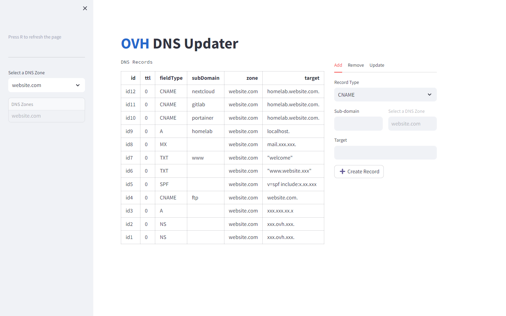

# OVH DNS Updater

This project is a DNS record management tool for updating DNS records on the OVH platform. Bilt with Python and Streamlit, it uses the OVH API to interact with DNS records.

*This project is in no way linked or official to OVH. AND it does not provide any guarantee whatsoever.*  
*It is simply an interface that facilitates my personal use for my homelab and that I decide to share publicly.*

## Screenshot


## Features
- Display 
- Quicly updates A, CNAME DNS records on OVH.
- Supports specifying custom TTL (Time to Live) for DNS records.

## Prerequisites
- OVH API credentials (application key, application secret, and consumer key) with the necessary permissions to update DNS records.  
    - You can generate the keys at this site: https://eu.api.ovh.com/createToken/

- Before running the script, you need to configure the following:
    - Set up your OVH API credentials in the script or use environment variables/configuration files as described in the [OVH Python library documentation](https://github.com/ovh/python-ovh#configuration).

## Usage
### Running script
1. Clone the repository

    ```bash
    git clone https://github.com/tbillaudeau/ovh-dns-updater.git
    ```

2. Navigate to the project directory

    ```bash
    cd ovh-dns-updater
    ```

3. Install required librares
   
    ```bash
    pip install requirements.txt -r
    ```

4. Run the script

    ```bash
    streamlit run main.py
    ```

### Using docker
1. Docker run

    ```docker
    docker run --name dsn-updater --restart unless-stopped -p 8501:8501 ghcr.io/tbillaudeau/ovh-dns-updater:main 
     ```

2. Docker compose

    ```yml
    version: '3.8'

    services:
    app:
        container_name: dsn-updater
        image: ghcr.io/tbillaudeau/ovh-dns-updater:main
        restart: unless-stopped
        ports:
        - 8501:8501
    ```

3. .env file

    ```bash
    OVH_ENDPOINT=XXX
    OVH_APPLICATION_KEY=XXX
    OVH_APPLICATION_SECRET=XXX
    OVH_CONSUMER_KEY=XXX
    ```

## Acknowledgements
- [OVH API Endpoints](https://eu.api.ovh.com/console-preview/?section=%2Fdomain&branch=v1#get-/allDom) related to domain configuration.
- This script utilizes the [OVH Python library](https://github.com/ovh/python-ovh) for interacting with the OVH API.
- This application leverages [Streamlit](https://streamlit.io/)'s Python interface.
- Special thanks this project from *slowphil* that gave me the idea https://github.com/slowphil/ovh-dns-updater.

---
> A project made with a lot of ❤️ by myself